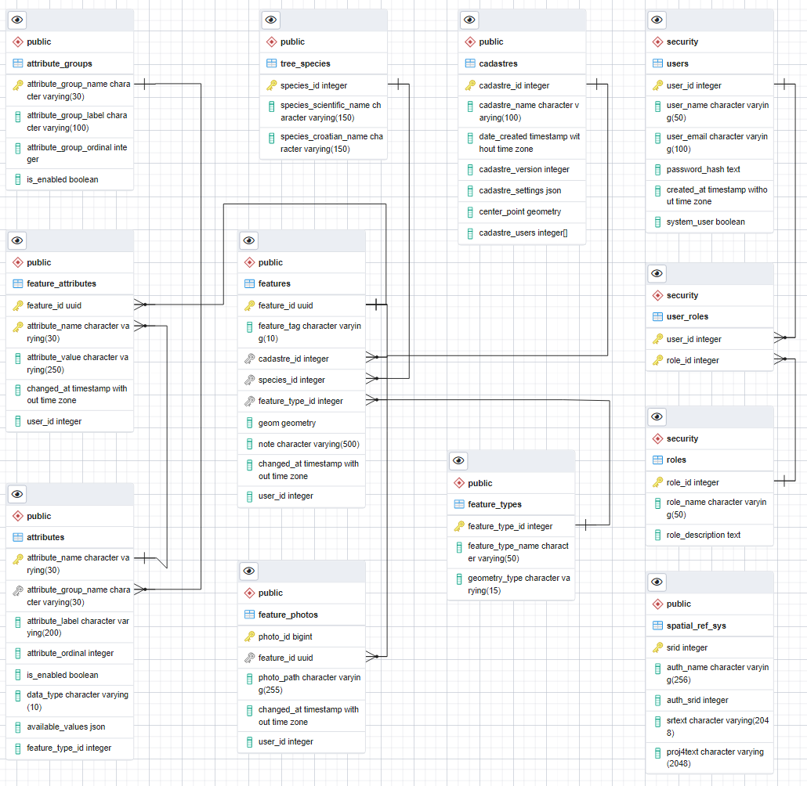

# Dokumentacija sustava za praćenje stanja drvenastih jedinki

## Sadržaj
- [Struktura atributa](#struktura-atributa)
- [Grupe atributa](#grupe-atributa)
  - [1. Fizičke karakteristike i starost](#1-fizičke-karakteristike-i-starost)
  - [2. Pridanak](#2-pridanak)
  - [3. Deblo](#3-deblo)
  - [4. Krošnja](#4-krošnja)
  - [5. Opće stanje](#5-opće-stanje)
  - [6. Preporuke](#6-preporuke)
- [Konvencije i napomene](#konvencije-i-napomene)
- [Baza podataka](#baza-podataka)
  - [Struktura baze podataka](#struktura-baze-podataka)
  - [Sheme](#sheme)
  - [Ključne tablice](#ključne-tablice)
  - [Konvencije imenovanja](#konvencije-imenovanja)
  - [Sigurnosni model](#sigurnosni-model)

## Struktura atributa
Atributi su organizirani u 6 glavnih grupa sa sljedećom strukturom:
- **Naziv atributa**
- **Tip podatka** (bool/text/double)
- **Dopuštene vrijednosti** (ako postoje)

## Grupe atributa

### 0. Bazni atributi
Bazni atributi su dio svakog zapisa geografske značajke (stabla).

| Atribut | Tip | Opis | Vrijednosti |
|---------|-----|------|-------------|
| ID | text | Jedinstveni identifikator (UID) | - |
| Datum mjerenja | date | Datum kada je izvršeno mjerenje | - |
| Geometrija | geometry | WKT geometrijska značajka (točka, linija, poligon - najčešće točka) | - |
| Korisnik | text | Korisničko ime osobe koja je unijela podatke | - |
| Botanička vrsta | text | Veza na šifru botaničke vrste | - |

### 1. Fizičke karakteristike i starost
Parametri fizičkih dimenzija stabla i procjenjena starost

| Atribut | Tip | Opis | Dostupne vrijednosti |
|---------|-----|------|----------------------|
| Promjer | double | Promjer stabla u metrima | - |
| Visina | double | Ukupna visina stabla | - |
| Visina debla | double | Visina debla do krošnje | - |
| Radius krošnje | double | Radijus širenja krošnje | - |
| Starost | integer | Procjenjena starost stabla u godinama | - |

### 2. Pridanak
Karakteristike prizemnog dijela stabla

| Atribut | Tip | Opis | Vrijednosti |
|---------|-----|------|-------------|
| Uredno | bool | Stanje održavanja | Da/Ne |
| Trulež | enum | Stupanj truleži | Mala, Srednja, Jaka |
| Mehaničke ozljede | enum | Vrsta oštećenja | Svježe, Stare, Dobro kalusiraju, Loše kalusiraju |
| Prelomljeno | bool | Prisutnost preloma | Da/Ne |
| Simptomi izvale | bool | Znakovi izvale | Da/Ne |
| Hipertrofije | enum | Prisutnost izraslina | Benigne, Maligne |
| Gljiva | enum | Vrsta gljivične infekcije | Phellinus pini, Ganoderma sp., Innotus sp., Phomopsis sp., Schizophyllum commune, Bolest iglica, Biscogniauxia mediterranea |
| Kukci | enum | Vrste štetnika | Mravi, Ksilofagi, Potkornjaci, Defolijator, Kornjaši truležari (listorošci), Crvena palmina pipa |
| Kolizija (sa infrastrukturom) | bool | Kolizija sa infrastrukturnim objektom (cesta, građevina, itd.) | Da/Ne |
| Plodišta truležnica | enum | Količina plodišta | Malobrojna, Brojna, Vrlo brojna |
| Ostali nametnici | enum | Vrste nametnika | Bršljan, Imela, Bakterije |

### 3. Deblo
Karakteristike debla

| Atribut | Tip | Opis | Vrijednosti |
|---------|-----|------|-------------|
| Nagnuto | bool | Stablo je nagnuto | Da/Ne |
| Suncožar | bool | Oštećenja od sunca | Da/Ne |
| Životinjska niša | bool | Prisutnost životinjskih nastambi | Da/Ne | 
| Pukotine | enum | Stanje pukotina | Kalusirala, Otvorena |
| Prelomljeno | bool | Prisutnost preloma | Da/Ne |
| Plodišta truležnica | enum | Količina plodišta | Malobrojna, Brojna, Vrlo brojna | 
| Bršljan | bool | Prisutnost bršljana | Da/Ne |
| Imela | bool | Prisutnost imele | Da/Ne |
| Bakterije | bool | Prisutnost bakterija | Da/Ne |
| Životinja | text | Vrsta životinje | - | 
| Trulež | enum | Stupanj truleži | Mala, Srednja, Jaka |
| Mehaničke ozljede | enum | Vrsta oštećenja | Svježe, Stare, Dobro kalusiraju, Loše kalusiraju |
| Hipertrofije | enum | Prisutnost izraslina | Benigne, Upitne |
| Gljiva | enum | Vrsta gljivične infekcije | Phellinus pini, Ganoderma sp., Innotus sp., Phomopsis sp., Schizophyllum commune, Bolest iglica, Biscogniauxia mediterranea |
| Kukci | enum | Vrste štetnika | Mravi, Ksilofagi, Potkornjaci, Defolijator, Kornjaši truležari (listorošci), Crvena palmina pipa |
| Ostali nametnici | text | Ostale vrste nametnika | - | 

### 4. Krošnja
Karakteristike krošnje

| Atribut | Tip | Opis | Vrijednosti |
|---------|-----|------|-------------|
| Oblik | enum | Oblik krošnje | Cilindrična, Elipsoidna, Sferična, Srcolika, Jablan, Četinjača |
| Suhe i trule grane | enum | Količina oštećenih grana | Malo, Puno |
| Prorijeđena | bool | Prorijeđenost krošnje | Da/Ne |
| Pregusta | bool | Prevelika gustoća | Da/Ne |
| Previsoka | bool | Prevelika visina | Da/Ne |
| Asimetrična | bool | Asimetrija krošnje | Da/Ne |
| Slomljene grane | bool | Prisutnost slomljenih grana | Da/Ne |
| Kolizija (s drugim stablom) | bool | Sukob s drugim stablom | Da/Ne | 
| Opasne grane | bool | Prisutnost opasnih grana | Da/Ne |
| Plodišta truležnica | enum | Količina plodišta | Malobrojna, Brojna, Vrlo brojna |
| Bršljan | bool | Prisutnost bršljana | Da/Ne |
| Imela | bool | Prisutnost imele | Da/Ne |
| Bakterije | bool | Prisutnost bakterija | Da/Ne |
| Životinja | text | Vrsta životinje | - |
| Mehaničke ozljede | enum | Vrsta oštećenja | Svježe, Stare, Dobro kalusiraju, Loše kalusiraju |
| Hipertrofije | enum | Prisutnost izraslina | Benigne, Upitne |
| Gljiva | enum | Vrsta gljivične infekcije | Phellinus pini, Ganoderma sp., Innotus sp., Phomopsis sp., Schizophyllum commune, Bolest iglica, Biscogniauxia mediterranea |
| Kukci | enum | Vrste štetnika | Mravi, Ksilofagi, Potkornjaci, Defolijator, Kornjaši truležari (listorošci), Crvena palmina pipa |
| Ostali nametnici | text | Ostale vrste nametnika | - | 

### 5. Opće stanje
Opća evaluacija, TRAQ, bonitet i vitalitet

| Atribut | Tip | Opis | Vrijednosti |
|---------|-----|------|-------------|
| Vitalitet | enum | Vitalnost stabla | Vrlo dobar, Dobar, Srednji (oslabljen), Narušen (potrebno pratiti), Loš, Vrlo loš, Nepoznat / Nije specificiran |
| TRAQ prije sanacije | enum | Razina rizika prije intervencije | Malen, Umjeren, Visok, Ekstreman |
| TRAQ nakon sanacije | enum | Očekivani rizik nakon intervencije | Malen, Umjeren, Visok, Ekstreman |
| Bonitet | enum | Kvalitativna ocjena | 1, 2, 3, 4, 5 |
| Loše | bool | Opće loše stanje | Da/Ne |
| Narušena statika | bool | Problemi sa statikom | Da/Ne |
| Sušac | bool | Suhoća stabla | Da/Ne | 
| Izvaljeno | bool | Stanje izvale | Da/Ne |
| Opasno | bool | Opasno stanje | Da/Ne |
| Srušeno | bool | Srušeno stanje | Da/Ne |
 
### 6. Preporuke
Preporučene intervencije

| Atribut | Tip | Opis | Vrijednosti |
|---------|-----|------|-------------|
| Prorijediti | enum | Postotak prorjeđivanja | 10%, 20%, 30%, 40% |
| Hitno | bool | Hitnost intervencije | Da/Ne |
| Sidriti | bool | Potreba za stabilizacijom | Da/Ne |
| Rušiti | bool | Preporuka rušenja | Da/Ne |
| Frezati | bool | Preporuka frezanja | Da/Ne |
| Orezati | bool | Preporuka rezanja | Da/Ne |

## Konvencije i napomene
1. **Tipovi podataka:**
   - `bool`: Binarna vrijednost (Da/Ne)
   - `double`: Decimalni broj za metričke vrijednosti
   - `enum`: Lista dopuštenih vrijednosti u JSON formatu
   - `integer`: Cijeli broj za numeričke vrijednosti bez decimalnih mjesta

2. **Primjer enum strukture:**
```json
{
"vitalitet": [
    {"value": "Vrlo dobar", "text": "Vrlo dobar"},
    {"value": "Dobar", "text": "Dobar"},
    {"value": "Srednji (oslabljen)", "text": "Srednji (oslabljen)"},
    {"value": "Narušen (potrebno pratiti)", "text": "Narušen (potrebno pratiti)"},
    {"value": "Loš", "text": "Loš"},
    {"value": "Vrlo loš", "text": "Vrlo loš"},
    {"value": "Nepoznat / Nije specificiran", "text": "Nepoznat / Nije specificiran"}
    ]
}
```

3. **Evaluacijski parametri:**
   - Vitalitet i bonitet su komplementarne mjere zdravstvenog stanja
   - **TRAQ (Tree Risk Assessment Qualification):** 
     - TRAQ je sustav za procjenu rizika povezanog s drvenastim jedinkama, koji se koristi za identifikaciju i evaluaciju potencijalnih opasnosti koje stablo može predstavljati za okolinu. 
     - Ovaj sustav procjenjuje faktore kao što su zdravlje stabla, strukturalna stabilnost, prisutnost štetnika ili bolesti, te vanjski uvjeti koji mogu utjecati na stablo.
     - Kategorije rizika uključuju: malen, umjeren, visok i ekstreman, što pomaže u donošenju odluka o potrebnim intervencijama kako bi se smanjio rizik.
     - TRAQ procjena je ključna za održavanje sigurnosti u urbanim i ruralnim područjima, omogućujući pravovremene i informirane odluke o upravljanju stablima.

4. **Strukturalne napomene:**
   - Svi atributi s enum tipom imaju definiranu listu dopuštenih vrijednosti
   - Boolean atributi nemaju dodatne parametre

5. **Digitalizacija procesa:**
   - Atributi su dizajnirani za korištenje u mobilnoj aplikaciji za terensko prikupljanje podataka koja će biti izrađena za prikupljanje podataka na terenu 
   - Podaci će se automatski sinkronizirati s centralnom bazom podataka
   - Digitalni pristup eliminira potrebu za papirnatim obrascima i ručnim prepisivanjem podataka
   - Struktura atributa osigurava konzistentnost i točnost prikupljenih podataka

## Baza podataka

### Struktura baze podataka


### Sheme
Baza podataka je organizirana u dvije glavne sheme:

1. **public** - sadrži osnovne tablice za rad s podacima
2. **security** - sadrži tablice vezane uz autentifikaciju i autorizaciju

### Ključne tablice

#### Public shema:
- **attribute_groups** - Definicije grupa atributa
  - attribute_group_name (char varying(30)) - naziv grupe
  - attribute_group_label (char varying(100)) - oznaka grupe
  - attribute_group_ordinal (integer) - redni broj grupe
  - is_enabled (boolean) - status aktivnosti

- **tree_species** - Katalog botaničkih vrsta
  - species_id (integer) - jedinstveni identifikator vrste
  - species_scientific_name (char varying(150)) - znanstveni naziv
  - species_croatian_name (char varying(150)) - hrvatski naziv

- **cadastres** - Katastarske općine
  - cadastre_id (integer) - identifikator katastarske općine
  - cadastre_name (char varying(100)) - naziv katastarske općine
  - center_point (geometry) - središnja točka
  - cadastre_settings (json) - postavke za katastarsku općinu

- **features** - Glavna tablica za pohranu podataka o stablima
  - feature_id (uuid) - jedinstveni identifikator stabla
  - cadastre_id (integer) - veza na katastarsku općinu
  - species_id (integer) - veza na botaničku vrstu
  - geom (geometry) - geometrija lokacije stabla
  - note (char varying(500)) - bilješke

- **feature_photos** - Fotografije stabala
  - photo_id (bigint) - identifikator fotografije
  - feature_id (uuid) - veza na stablo
  - photo_path (char varying(255)) - putanja do fotografije

#### Security shema:
- **users** - Korisnici sustava
  - user_id (integer) - identifikator korisnika
  - user_name (char varying(50)) - korisničko ime
  - user_email (char varying(100)) - email adresa
  - password_hash (text) - kriptirana lozinka
  - system_user (boolean) - oznaka sistemskog korisnika

- **roles** - Uloge u sustavu
  - role_id (integer) - identifikator uloge
  - role_name (char varying(50)) - naziv uloge
  - role_description (text) - opis uloge

- **user_roles** - Veze korisnika i uloga
  - user_id (integer) - veza na korisnika
  - role_id (integer) - veza na ulogu

### Konvencije imenovanja
1. Nazivi tablica su u množini (features, users, roles)
2. Primarni ključevi koriste prefiks imena tablice (user_id, role_id)
3. Strani ključevi zadržavaju ime primarnog ključa na koji se referenciraju

### Sigurnosni model
- Svaki korisnik mora imati dodijeljenu barem jednu ulogu
- Sistemski korisnici (system_user = true) imaju posebna prava
- Lozinke se pohranjuju isključivo u kriptiranom obliku